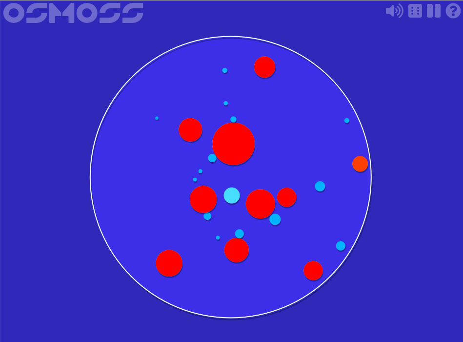

# Osmo

## About

Osmo is a game the web browser, made entirely using HTML5, and inspired heavily by the gameplay of Osmos.

The rules are simple; click to propel yourself around, and try to absorb smaller cells until you become the biggest. Watch out for larger cells, or they will absorb you!

## Screenshots



## Install

```bash
# Clone this repository
git clone https://github.com/stevenjoezhang/osmo.git
# Go into the repository
cd osmo
# Install dependencies
npm install
```

## Usage

After cloning this repository, run the follow commands to install dependencies and set up server. Enjoy!

```bash
npm start
```

You can configure the game by editing `config.json`.

**WARNING: Remember to build again after editing any file, include `config.json`.**

## Build

```bash
npm run build
```

## License

Osmo is forked from [Browsmos](https://github.com/BHSPitMonkey/Browsmos).

> ### License
> Any JavaScript sources within Browsmos are hereby licensed under the Simplified BSD License. You are free to modify and redistribute Browsmos, but, if you do, please:
> - don't distribute modifications as though they are my own
> - consider including an attribution, preferably linking to this page
